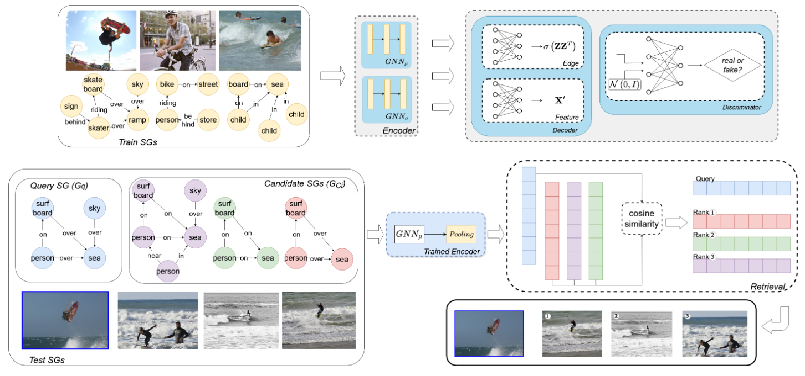

# SCENIR: Visual Semantic Clarity through Unsupervised Scene Graph Retrieval



This repository provides the official implementation for the paper:
**"SCENIR: Visual Semantic Clarity through Unsupervised Scene Graph Retrieval"**
by Nikolaos Chaidos, Angeliki Dimitriou, Maria Lymperaiou, and Giorgos Stamou. Poster at ICML 2025.


[[`Paper`](https://arxiv.org/abs/2505.15867)]


This project introduces ***SCENIR*** *(SCene-graph auto-ENcoder for Image Retrieval)*, a novel framework that addresses biases in image-to-image retrieval by focusing on semantic content. It leverages an unsupervised Graph Autoencoder, eliminating the need for labeled training data.

## Features

* **Unsupervised Retrieval**: Utilizes a Graph Autoencoder for unsupervised scene graph-based image retrieval.
* **Semantic Focus**: Emphasizes semantic content to overcome low-level visual feature biases.
* **GED Ground Truth**: Advocates and uses Graph Edit Distance (GED) as a robust ground truth measure for evaluation, overcoming inconsistencies of caption-based similarities.
* **Superior Performance**: Outperforms existing methods in retrieval accuracy and computational efficiency.
* **Generalizable**: Applicable to real-world unannotated images via Scene Graph Generation.


## Setup and Installation

Follow these steps to set up the environment. It's recommended to use a virtual environment (e.g., conda or venv). Our experiments were conducted on Python 3.11 with CUDA 12.4 on a single NVIDIA T4 GPU.

**1. Clone the Repository:**
```bash
git clone https://github.com/nickhaidos/scenir-icml2025.git
cd scenir-icml2025
```
Make sure `git` is already installed on your system.

**2. Install Python Dependencies:**
A `requirements.txt` file is provided.
```bash
pip install -r requirements.txt
```

**2. Install Preprocessed Dataset from HuggingFace:**
For reproduction we provide the complete preprocessed subset from PSG that we used for training and testing.
```bash
git clone https://huggingface.co/datasets/Nick2364/SCENIR-ICML2025-PSG
```

## Usage

The main script for running the analysis is `main.py`.

**Command-Line Arguments:**

The script accepts various arguments to configure the training/evaluation:

* `--config`: (Required) Path to the config.json file for the model hyperparameters and training details.
* `--device`: "cpu" or "cuda".
* `--train`: Flag for whether to train the model.
* `--test`: Flag for whether to evaluate the model on the test data.
* `--train_dataset_path`: Path to `final_train_graphs.pkl` from the hugging-face preprocessed dataset (only required if --train flag set to True).
* `--test_dataset_path`: Path to `final_test_graphs.pkl` from the hugging-face preprocessed dataset (only required if --test flag set to True).
* `--test_dataset_ged_path`: Path to `ged_ground_truth.pkl` from the hugging-face preprocessed dataset (only required if --test flag set to True).
* `--output_path`: Path to directory to store training checkpoints, training log and evaluation metrics.
* `--verbose`: Whether to print training log also in the console.
* `--checkpoint`: Path to .pth file, to continue training/testing from this saved model checkpoint.

**Example:**
```bash
python main.py \\
    --config ./path/to/config.json \\
    --device cuda \\
    --train \\
    --test \\
    --train_dataset_path ../path/to/final_train_graphs.pkl \\
    --test_dataset_path ../path/to/final_test_graphs.pkl \\
    --test_dataset_ged_path ../path/to/ged_ground_truth.pkl \\
    --output_path ./out
```

## Output

The script saves a `training_log.txt` with the per-epoch loss values, .pth checkpoint files and an `output_metrics.json`for the calculated retrieval metrics on the test set. The JSON file has the following structure:

```python
{
    "k_1": {                             # k_rank for retrieval metrics
        "map": 0.331,                    # Mean Average Precision
        "mrr": 0.466860308308408,        # Mean Reciprocal Rank
        "ndcg": 0.21733802220667067      # Normalized Discounted Cumulative Gain 
    },
    "k_3": {
        "map": 0.40724999999999933,
        "mrr": 0.466860308308408,
        "ndcg": 0.19808152674777765
    }
}
```


## Ground Truth Computation

Additionally, we provide the functions for reproducing the Graph Edit Distance computation, for the ground-truth similarities. This requires the computed embeddings file `psg_category_embeddings.pkl`, also available on huggingface.

```bash
python compute_ged_scores.py \\
    --test_dataset ./final_test_graphs.pkl \\
    --psg_cat ./psg_category_embeddings.pkl \\
    --output ged_ground_truth.pkl
```

## Citing Our Work

If you find this repository and our paper useful in your research, please consider citing:

```bibtex
@inproceedings{chaidos2025scenir,
  title={SCENIR: Visual Semantic Clarity through Unsupervised Scene Graph Retrieval},
  author={Chaidos, Nikolaos and Dimitriou, Angeliki and Lymperaiou, Maria and Stamou, Giorgos},
  booktitle = {Proceedings of the 42nd International Conference on Machine Learning (ICML)},
  year      = {2025},
  publisher = {PMLR},
  url       = {https://arxiv.org/abs/2505.15867v1},
}
```

## License

The code in this repository is under the MIT License.

## Contact

For questions or issues, please contact us at `nchaidos@ails.ece.ntua.gr` or open an issue in this repository.
